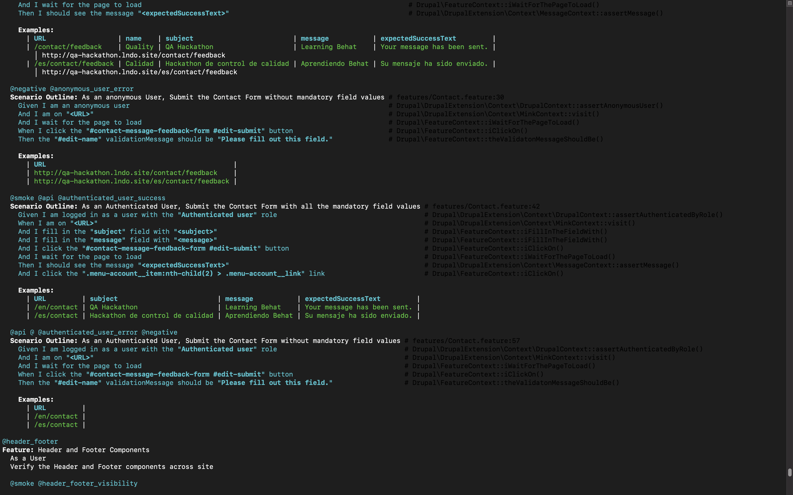

# Implementing Automated Tests in Acquia BLT - Umami Profile(Bilingual Site)



# About Project
   * This project is based on BLT 12.x with Lando local env, an open-source project template and tool that enables building, testing, and deploying Drupal installations following Acquia Professional Services best practices.
   * Please refer and follow this [READ ME](/SetUp_README.md) for local setup and workflow.
   * About [Umami Installation Profile](https://www.drupal.org/project/demo_umami)

# About Automated Tests

* **Testing Frameworks:**
  * [behat](https://docs.behat.org/en/latest/) - For both front-end & back-end functional tests
  * [cypress.io](https://www.cypress.io/)  - For front-end visual tests & functional tests with enabling [JSON:API module](https://www.drupal.org/project/jsonapi)


* Base url of the site: https://qa-hackathon.lndo.site/


* Testing features belongs to **behat** are tagged with the following primary tags:
    * @contact_us_form => Covers contact us form submission with positive and negative cases
    * @create-article => Covers create and verify the article through UI
    * @header_footer => Covers header and footer elements in several pages
    * @basic_search => Covers basic search scenarios in detail


* Validate the features in both "English" & "Spanish" Sites


### Commands for behat - test execution

* Test execution using tags:

```
  $ lando blt tests:behat:run -D behat.tags=@contact_us_form
  $ lando blt tests:behat:run -D behat.tags=@create-article
  $ lando blt tests:behat:run -D behat.tags=@header_footer
  $ lando blt tests:behat:run -D behat.tags=@basic_search
```
* Test execution using feature file name:

```
  $ lando blt tests:behat:run -D behat.paths=Article.feature
  $ lando blt tests:behat:run -D behat.paths=Contact.feature
  $ lando blt tests:behat:run -D behat.paths=HeaderAndFooter.feature
  $ lando blt tests:behat:run -D behat.paths=Search.feature
```
  * Note: Please refer this [BLT-Automated Testing documentation](https://docs.acquia.com/blt/developer/testing/) for various useful commands and test directory structure in detail.

### Configure the front-end dependencies, tests in BLT

  *  Please refer this [BLT-front-end documentation](https://docs.acquia.com/blt/developer/frontend/) for front-end related configuration in blt.yml.

* Testing belongs to **cypress** covers the following tests
    * article_validation_via_json_api.spec.js => Validation of articles via JSON:API'
    * vr_home_page.spec.js => Visual Validation of Home Page using [Applitools](https://applitools.com/)
      * Note: set the value of an environment variable APPLITOOLS_API_KEY based on our OS as mentioned [here](https://www.npmjs.com/package/@applitools/eyes-cypress) or update that variable's value in this file: /docroot/themes/custom/axe/.as-a.ini


### Commands for front-end tests

* The following command executes 'source:build:frontend-reqs' target hook from blt.yml which takes care of installing cypress related dependencies in our case
```
  $ blt source:build:frontend-reqs
```
* The following command executes 'source:build:frontend-test' target hook from blt.yml and takes care of executing the tests
```
  $ blt tests:frontend
```